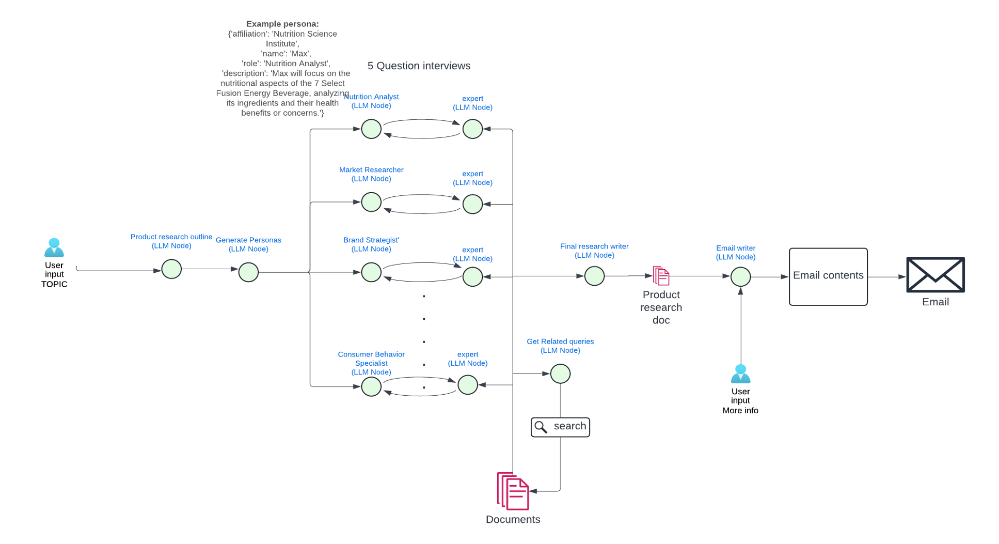

# databricks-hackathon-oct2024
This repository contains the codes for the app developed for the Databricks GenAI Hackathon - October 2024

## Setup

```bash
pip install -r requirements.txt
```

## Run
- Set the environment variables in the `.env` file. You can use the `.env.local` as a template.
- Rename `models.yaml.local` to `models.yaml`.
- Run the app with `python app.py`.

## Notes
- The app will generate images in the `generated_images` folder.
- The app will save the fine-tuned model in the GCS bucket. You need to have the `gc_service_account_key.json` file in the same folder as the `app.py` file. You also need to update the `GCS_BUCKET_NAME` in the `.env` file.
- The USERNAME variable in the `.env` file is your username in Replicate.


# What is MailGen?

**MailGen** is a generative AI (GenAI) tool designed to streamline the creation of email marketing campaigns, reducing the process from weeks to days. Traditional email campaign design is time-consuming, involving extensive product or company research, creating a campaign brief, drafting the email content, and designing graphics. These tasks require significant research and creativity.

By leveraging GenAI, MailGen automates much of the research and creative processes, allowing campaign designers to focus on final adjustments. The tool aims to expedite the ideation-to-campaign cycle significantly.

## Components of MailGen

MailGen comprises two main components:

1. **Agentic Market Research Component**
This component functions as an agentic system that takes the product name and campaign description from the user and performs the following steps:
- **Research Outline Generation:** It creates a structured outline for the research based on user input.
- **Persona Generation:** It develops various personas to address different parts of the outline. 
  - For example, a persona named "Jordan" might be created with attributes like:
    - **Affiliation:** Social Media Analytics Company
    - **Role:** Sentiment Analyst
    - **Description:** Focused on collecting customer feedback and conducting sentiment analysis using social media, online reviews, and surveys.
  - Each persona can consult with a subject expert to accomplish their tasks and has access to internet search tools (e.g., DuckDuckGo) for research purposes.
- **Final Report Compilation:** It gathers findings from all personas and condenses them into the research outline generated in the first step.

- **Email Generation:** Using the final report and initial user inputs, it generates the email content, including both the body and subject line.

You can see the full process in the image below:



2. **Image Component**
MailGen assists in creating campaign images through the following tasks:
   - **Image Generation:** Utilizes prompts to generate images for the ad campaign, enabling rapid iteration of ideas. The FLUX family of models is used due to their high-quality output with minimal generation steps.
**Image Editing:** Allows for editing existing images using a combination of FLUX-inpainting and ControlNet models, useful for making minor modifications.
**Fine-Tuning:** Enables fine-tuning of an image generation model using at least 10 images. This is particularly helpful when existing campaign images are available, and similar new images are desired. The FLUX-dev-Lora-Trainer API accepts image files in a zip format and performs LoRA fine-tuning on the FLUX model. The fine-tuned model is then added to the user's available models for image generation.

## Hackathon Questions

**Industry and Topic:** Marketing and Advertising, specifically Email Marketing.

**Reason for Choosing the Topic:** Designing an email marketing campaign is labor-intensive, involving both research and creativity—areas where large language models (LLMs) and vision-language models (VLMs) excel. By applying GenAI, MailGen aims to automate most of the process, reducing the time from ideation to campaign launch from weeks to days.

**Datasets and Models Used:**

- **LangChain:** An LLM orchestration framework.
- **LangGraph:** An agentic framework for LLMs.
- **Replicate:** A compute platform for fine-tuning and image generation.
- **FLUX-Schnell:** Used for image generation.
- **FLUX-Inpainting-ControlNet Model:** Used for image editing, trained on 12 million images from the LAION2B dataset.
- **FLUX-dev Lora Trainer:** For fine-tuning the FLUX model.


**Problem-Solving Approach:** Developed an agentic system to automate market research and email generation steps, incorporating internet search tools for comprehensive research. Utilized FLUX models for various image-related tasks, including generation, editing, and fine-tuning, to enhance the graphical design aspect of email campaigns.

**Conclusion:**

MailGen demonstrates how GenAI can significantly optimize the email marketing campaign process by automating research and creative tasks. By integrating advanced language and image models, it allows marketers to produce effective campaigns more efficiently, focusing their efforts on final refinements rather than the bulk of the groundwork.